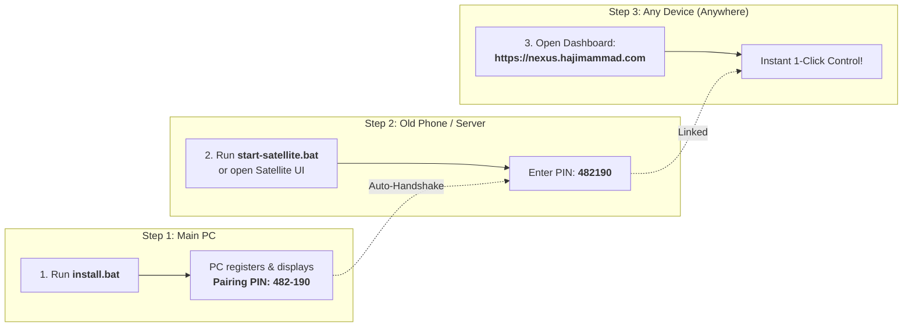

# 🪐 Nexus PC Command Center — Standardized Universal PC Controller

A zero-configuration, high-performance remote PC power, security, and telemetry management platform. Control, wake, sleep, restart, lock, unlock, and run PowerShell terminal commands on your Windows PC from anywhere in the world across any network (4G/5G, local Wi-Fi, or remote WAN).

---

## ⚡ Key Capabilities

1. **⚡ Remote Turn ON (Wake-on-LAN from Anywhere)**:
   - Uses the **Nexus Satellite (Home Relay)** on your home network to broadcast raw UDP Wake-on-LAN magic packets on demand.
   - Works globally over 4G/5G without router port forwarding.

2. **🔓 Remote Windows Lock & Unlock**:
   - **Lock Screen**: Instant session isolation (`tsdiscon` / `LockWorkStation`).
   - **Unlock Screen**: Automatic session re-attachment via local OpenSSH (`tscon /dest:console`), bypassing the lock screen.

3. **🔒 Remote Sleep, Restart, and Shut Down**:
   - Instant ACPI low-power sleep, 1-second system reboot, and full hardware shutdown.

4. **💻 Built-in Remote PowerShell Terminal**:
   - In-browser interactive CLI console to execute PowerShell scripts, inspect running processes, and query network configs with 1 tap.

5. **📊 Live Hardware Telemetry**:
   - Real-time streaming CPU %, RAM % (Used / Total GB), and system uptime tracking over WebSockets.

6. **🖥️ One-Click Remote Access Gateways**:
   - Direct deep-links to **Chrome Remote Desktop** and **Google Antigravity**.

---

## 🚀 3-Step Setup for Any User



### Step 1: Install on your Windows PC
1. Double-click **`install.bat`** (Automatically requests Administrator privileges).
2. The installer automatically:
   * Installs and starts the background agent service.
   * Enables the native Windows OpenSSH Server capability for remote unlock.
   * Configures Windows Firewall rules for port `48880` and port `22`.
   * Registers `NexusPCAgent` in Windows Task Scheduler to start at boot before login.

### Step 2: Set up the Home Relay (Old Phone / Server)
1. On any device that stays at home on your Wi-Fi (old phone, old laptop, Raspberry Pi, or mini server):
   * Run `node satellite/server.js` (or double-click `satellite/start-satellite.bat`).
2. Open `http://localhost:5050` (or `http://<device-ip>:5050` in your phone browser).
3. Type the **6-Digit Pairing PIN** and tap **Connect & Pair**.

### Step 3: Open your Dashboard Anywhere
1. Open your dashboard at: **[https://nexus.hajimammad.com](https://nexus.hajimammad.com)** (or `https://your-project.pages.dev`).
2. Tap **Pair PC**, type your 6-digit PIN (or open the 1-tap link: `https://nexus.hajimammad.com/#pair=482-190`).
3. You now have full 1-click remote control of your PC from anywhere in the world!

---

## 📂 Standardized Project Architecture

```text
nexus-dashboard_standard/
├── agent/                  # PC Background Companion Daemon (Node.js + Windows Win32 APIs)
│   ├── server.js           # Power commands, local REST API, OpenSSH unlock, WebSocket client
│   └── package.json
│
├── satellite/              # Universal Home Relay (Runs 24/7 on Home Wi-Fi)
│   ├── server.js           # UDP Wake-on-LAN broadcaster & OpenSSH unlock dispatcher
│   ├── public/             # Built-in lightweight 6-digit pairing & status Web UI
│   ├── start-satellite.bat # 1-click startup script
│   └── package.json
│
├── client/                 # Futuristic React + Vite + Tailwind Web Dashboard
│   ├── src/
│   │   ├── components/     # UI Tiles, Modals (Pair, ConfirmPower, Terminal, Settings)
│   │   └── utils/api.js    # RelayManager WebSocket client & 6-digit pairing helper
│   └── vite.config.js      # Production build configuration
│
├── dist/                   # Production built static web assets
├── worker.js               # Cloudflare Worker (Static asset serving + 6-digit pairing + WebSocket room relay)
├── install.bat             # 1-Click self-elevating PC installer
├── register-task.ps1       # Windows Task Scheduler boot installer script
└── wrangler.json           # Cloudflare deployment manifest
```

---

## 🔒 Security & Privacy

* **End-to-End Room Isolation:** Each user's PC is assigned an isolated cryptographic room and token in the Cloudflare Relay. No user can ever see or interact with another user's machine.
* **Rate Limiting & Timing-Safe Hashes:** All local and remote endpoints are throttled against brute force attacks and use constant-time cryptographic comparisons.
* **Firewall Safe:** Connections from your PC and Home Relay to Cloudflare are outbound WebSockets—no incoming ports need to be forwarded on your home router.
